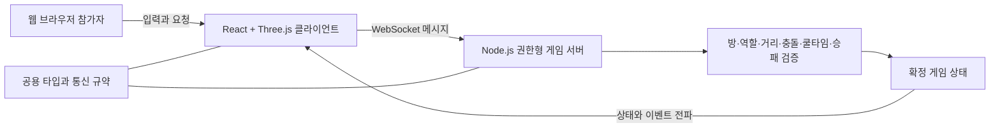
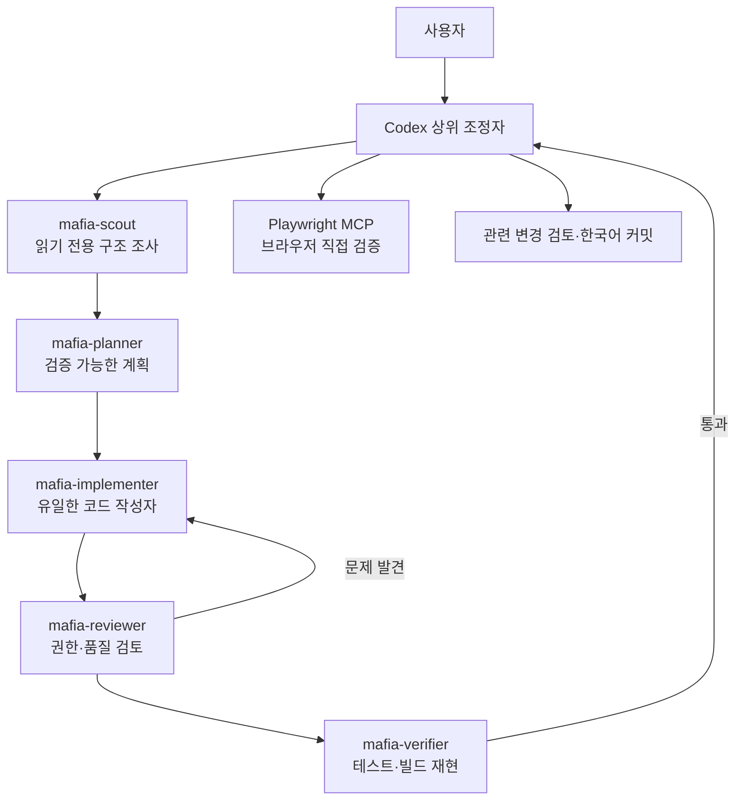

# 3D 소셜 디덕션 마피아 게임

최대 25명이 한 방에서 즐기는 웹 기반 3D 멀티플레이 사회 추리 게임입니다. 생존자는 임무와 시설 복구로 승리를 노리고, 마피아는 처치와 방해 공작으로 생존자를 고립시킵니다.

현재는 기본 5개 개발 페이즈를 완료하고 시설, 임무, 결과 화면을 확장한 시제품 단계입니다. 게임 판정에 영향을 주는 이동, 처치, 상호작용, 투표, 임무와 승패는 클라이언트가 아닌 서버가 검증합니다.

## 기술 구성

- 클라이언트: TypeScript, React 19, Vite, Three.js, React Three Fiber, Drei, Rapier, Zustand, Tailwind CSS
- 서버: Node.js, TypeScript, `ws` 기반 권한형 WebSocket 서버
- 공용 영역: 클라이언트와 서버가 함께 쓰는 상태 타입, 상수, 통신 규약
- 테스트: Vitest, Playwright MCP 기반 실제 브라우저 검증
- 에이전트: Codex, Pi Coding Agent, 로컬 Qwen 3.8 27B

```text
codes/
├── client/   React 기반 대기실, HUD, 회의 화면과 3D 게임 월드
├── server/   방, 참가자, 게임 규칙과 환경 상태를 관리하는 권한형 서버
└── shared/   양쪽에서 공유하는 타입, 상수와 WebSocket 메시지 규약
```

## 실행 방법

### 준비 사항

- Node.js 24 권장
- npm workspace를 지원하는 npm
- WebGL을 지원하는 데스크톱 웹 브라우저

저장소를 받은 뒤 의존성을 설치합니다.

```bash
cd codes
npm install
```

### 서버 실행

첫 번째 터미널에서 다음 명령을 실행합니다.

```bash
cd codes
npm run dev:server
```

게임 서버는 기본적으로 모든 네트워크 인터페이스의 2567 포트에서 요청을 받습니다. 파일 변경 감시 없이 서버를 실행하려면 다음 명령을 사용합니다.

```bash
npm --workspace server run start
```

다른 포트를 쓰려면 `PORT` 환경변수를 지정합니다.

```bash
PORT=2568 npm --workspace server run start
```

### 클라이언트 실행

두 번째 터미널에서 다음 명령을 실행합니다.

```bash
cd codes
npm run dev
```

Vite가 출력한 주소로 접속합니다. 기본 개발 주소는 보통 `http://localhost:5173`입니다. 클라이언트는 별도 설정이 없으면 웹 페이지를 연 호스트의 2567 포트에 연결하므로, 같은 공유기의 다른 컴퓨터에서 `http://<개발 컴퓨터 IP>:5173`으로 접속해도 같은 개발 컴퓨터의 게임 서버를 사용합니다.

게임 서버가 다른 호스트나 포트를 사용한다면 클라이언트에도 전체 주소를 전달합니다.

```bash
VITE_GAME_SERVER_URL=ws://localhost:2568 npm run dev
```

같은 공유기의 다른 컴퓨터에서 접속할 때는 개발 컴퓨터 방화벽에서 사설 네트워크의 TCP 5173·2567 포트를 허용해야 합니다. 인터넷 공유기 외부로 포트를 공개할 필요는 없습니다.

### 테스트와 빌드

```bash
cd codes
npm test
npm run build
```

`npm test`는 각 workspace의 Vitest 테스트를 실행하고, `npm run build`는 TypeScript 검사와 클라이언트 생산 빌드를 수행합니다.

## 기본 조작

| 입력 | 기능 |
| --- | --- |
| `WASD` 또는 방향키 | 이동 |
| `Shift` | 달리기 |
| 화면 클릭 후 마우스 | 시점 회전과 조준 |
| `E` | 가까운 장치 사용, 임무 수행 또는 복구 유지 |
| `Q` | 마피아의 처치 대상 전환 |
| `F` 또는 왼쪽 클릭 | 마피아 처치 또는 시체 신고 |
| `Caps Lock` 유지 | 마피아 시설 방해 공작 지도 |
| `B` | 시민 경보 바리케이드 설치 |
| `Escape` | 열린 장치 화면을 닫고 게임 입력 복구 |

## 구현된 게임 기능

### 방과 실시간 멀티플레이

- 6자리 코드로 방 생성과 입장
- 방당 최대 25명, 준비 상태와 방장 게임 시작
- 방장 권한 이전, 명시적 방 삭제와 연결 해제 뒤 재접속
- 초당 15회 수준의 이동 입력, 서버 속도·충돌 검증과 원격 참가자 보간
- 참가자별 안전한 시작 위치, 확장 야외 맵과 서버·클라이언트 공용 충돌 모델

### 역할, 처치와 승패

- 생존자와 마피아 역할 비공개 배정
- 역할, 생존 여부, 거리와 재사용 대기시간을 확인하는 서버 권한 처치
- 시체 생성, 신고, 사망자 관전 대상 전환과 마지막 처치 뒤 신고 유예
- 모든 마피아 추방 또는 공통 임무 완료 시 생존자 승리
- 살아 있는 마피아가 시민 수 이상이거나 핵심 과부하 제한 시간이 끝나면 마피아 승리
- 승리 진영, 자신의 역할과 승패 표시 후 같은 방에서 다음 판 초기화

### 회의와 투표

- 시체 신고 또는 긴급 회의 종으로 회의 시작
- 생존자 채팅, 참가자 상태 표시, 투표와 건너뛰기
- 중복 투표 차단, 최다 득표자 추방과 동점 무추방
- 회의 중 게임 입력 차단, 결과 표시 후 기존 위치로 복귀

### 시설과 방해 공작

- 문과 보안 셔터 개폐·잠금
- 발전기 정전과 시민의 3초 유지 복구
- CCTV 관제실과 정전·통신 장애 연동
- 통신 장애와 지정 장치 복구
- 시민이 한 판에 한 번 설치하는 30초 경보 바리케이드와 마피아 해체
- 마피아 전용 양방향 환풍구 이동
- 60초 핵심 전력 과부하와 양쪽 발전기 긴급 초기화

### 생존자 임무

- 정해진 색 순서를 맞추는 회로 연결
- 보급 상자에서 통신실까지 물품 운송
- 방향 순서를 입력하는 보안 카드 인증
- 시민 두 명이 5초 동안 함께 유지하는 교량 동기화 협동 임무
- 서버의 역할, 거리, 순서, 정답, 중복 완료와 중단 조건 검증

## 게임 실행 구조



클라이언트는 입력을 보내고 확정 상태를 그리는 역할을 맡습니다. 서버는 요청이 현재 게임 상태에서 가능한지 검증한 뒤 결과를 방 전체에 전파합니다. 이 경계는 조작된 클라이언트가 이동, 처치, 임무 완료나 승패를 임의로 확정하지 못하게 합니다.

## 멀티에이전트 구성

상위 Codex가 사용자 요청, 작업 범위, Git 상태와 최종 품질을 책임지고, 로컬 Pi Coding Agent와 Qwen 에이전트는 역할별로 조사와 독립 검증을 지원합니다. 단일 로컬 모델 서버의 메모리와 응답 지연을 고려해 기본 동작은 병렬 작성이 아닌 순차 인수인계입니다.



역할별 책임은 다음과 같습니다.

- `mafia-scout`: 관련 코드, 문서, 호출 경로와 서버 권한 위험을 읽기 전용으로 조사합니다.
- `mafia-planner`: 수정 파일, 검증 지점, 테스트와 화면 검증 범위를 작은 계획으로 만듭니다.
- `mafia-implementer`: 승인된 범위의 유일한 작성자로 구현하고 자체 검증합니다.
- `mafia-reviewer`: 클라이언트 입력 신뢰, 거리·역할·상태·쿨타임 검증과 통신 규약 일관성을 검토합니다.
- `mafia-verifier`: 코드를 수정하지 않고 테스트와 빌드를 다시 실행해 결과를 재현합니다.
- Codex 상위 조정자: 모호한 설계 확인, 변경 통합, Playwright MCP 화면 검증, 최종 판단과 커밋을 담당합니다.

상세한 로컬 모델 설정과 운영 방법은 [로컬 Pi 멀티에이전트 운영 안내](docs/LOCAL_PI_MULTI_AGENT.md)를 참고하세요.

## 사용한 Skills

프로젝트의 단계별 구현에는 `.agents/skills/`의 다음 작업 스킬을 사용했습니다.

| Skill | 기능 |
| --- | --- |
| `project-initializer` | 요구사항을 바탕으로 기본 문서, 규칙과 5개 페이즈 구조를 만듭니다. |
| `initializer-validator` | 초기 문서 사이의 링크, 누락과 요구사항 일관성을 확인합니다. |
| `phase-workflow` | 각 개발 페이즈의 구현부터 검증과 기록까지 전체 흐름을 조정합니다. |
| `phase-executor` | 페이즈 문서의 범위와 완료 기준에 맞춰 기능을 구현합니다. |
| `apply-ui-styling` | Tailwind CSS 반응형 화면을 적용하고 Playwright MCP 검증을 연결합니다. |
| `auto-test-fixer` | 실패한 테스트의 원인을 찾아 코드 수정과 재실행을 반복합니다. |
| `critical-bug-review` | 문제를 `BLOCKING`과 `NIT`로 분류하고 차단 오류를 우선 해결합니다. |
| `phase-verifier` | 페이즈 체크리스트, 실제 코드, 테스트와 브라우저 동작을 교차 검증합니다. |
| `harness-compounder` | 반복 실패와 해결 방법을 누적해 다음 페이즈의 작업 방식을 개선합니다. |
| `skill-creator` / `skill-validator` | 저장소 전용 Skill을 만들고 형식, 이름과 지침 품질을 점검합니다. |

화면 변경은 에이전트 보고만으로 완료하지 않고 Codex가 Playwright MCP를 직접 사용해 375px, 768px, 1280px 화면을 확인합니다. 로컬 Pi는 코드 검토와 테스트 재현을 보조하지만 브라우저 검증을 대신하지 않습니다.

## 개선 방향

### 게임 기능

1. 처치, 신고, 관전과 주요 장치 상호작용을 실제 다중 참가자 환경에서 한 판 끝까지 회귀 검증합니다.
2. 중앙홀, 발전실, 통신실, 의무실, 연구실, 창고, 정비실과 격납고를 연결해 실내 구역과 전략적 동선을 확장합니다.
3. 경고와 대응 시간을 갖춘 증기, 가스 또는 감전 위험 구역을 추가합니다.
4. 환풍구를 두 지점 이동에서 서버가 검증하는 연결 그래프로 확장합니다.
5. 회의에 신고 위치·시간 같은 사건 정보와 상세 투표·추방 결과를 추가합니다.
6. PRD의 참가 인원별 마피아 추천 수를 경계값 테스트와 함께 정확히 적용합니다.
7. 시작, 역할 공개, 회의 결과와 게임 결과를 더 명확한 서버 상태와 연출로 분리합니다.
8. 25명 동시 접속, 장시간 재접속과 주요 화면의 반복 부하 검증을 자동화합니다.

### 멀티에이전트 구성

1. 조사, 계획, 구현, 검토 단계의 전달 형식을 구조화해 수정 파일, 위험, 완료 조건과 검증 결과가 빠지지 않게 합니다.
2. 현재의 단일 작성자 원칙은 유지하되, 서로 독립적인 큰 작업만 별도 Git worktree에서 진행하고 상위 에이전트가 순서대로 통합합니다.
3. 서버 권한·보안 변경은 자동으로 `mafia-reviewer`와 `mafia-verifier`의 독립 검토를 거치도록 위험 기반 경로를 강화합니다.
4. 테스트 결과, 걸린 시간, 재시도 원인과 반복 오류를 수집해 어떤 역할과 Skill이 병목인지 측정합니다.
5. 로컬 모델 서버가 여러 작업을 안정적으로 처리할 수 있을 때만 읽기 전용 조사와 검증을 제한적으로 병렬화합니다.
6. 최종 품질 관문에 테스트, 생산 빌드, Git 차이 검사와 Playwright MCP 반응형 검증 결과를 일관된 보고 형식으로 묶습니다.

## 관련 문서

- [제품 요구사항](docs/PRD.md)
- [상세 구현 명세](docs/DETAIL_SPEC.md)
- [작업 규칙](docs/RULES.md)
- [콘텐츠 개발 백로그](docs/CONTENT_BACKLOG.md)
- [현재 작업 재개 메모](resume.md)
